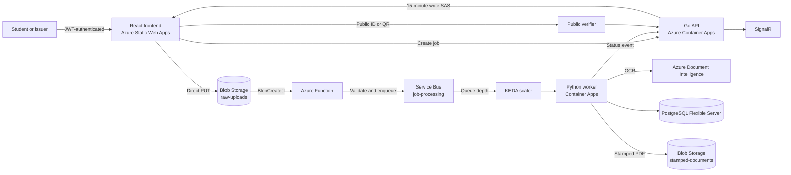
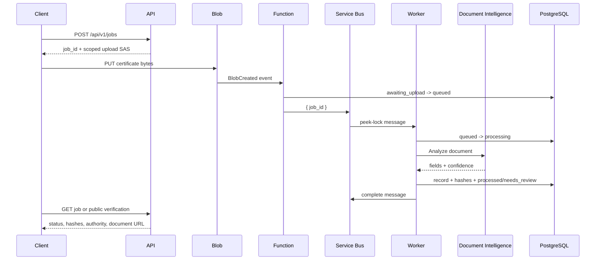
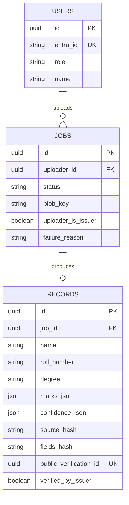

# Credenviel

## Certificate Digitization and Verification Pipeline

Credenviel converts scanned academic certificates and marksheets into structured, confidence-scored records. It routes uncertain OCR results to an issuer review station, seals accepted records with SHA-256 hashes, and exposes a QR-linked public verification page.

The project addresses the archive backlog that remains outside digital certificate systems: older paper records, scanned certificates, admission verification, placement checks, and institutional document searches.

## Objectives

- Digitize certificates and marksheets into searchable structured records.
- Extract fields and tabular marks with confidence values.
- Route low-confidence or empty OCR results to human review.
- Preserve source and canonical field hashes for tamper evidence.
- Provide QR-based public verification and document viewing.
- Absorb upload bursts through Service Bus and KEDA-scaled workers.
- Keep idle compute close to zero and manage Azure student-credit costs.

## Architecture



### Processing sequence



### Service selection

| Concern | Technology | Reason |
|---|---|---|
| Frontend | React + Vite + Static Web Apps | Fast SPA delivery with HTTPS and client-side routing. |
| API | Go on Azure Container Apps | Small, typed service for authentication, job state, SAS issuance, and verification. |
| OCR | Azure Document Intelligence | Structured fields and confidence scoring rather than plain text OCR. |
| Queue | Azure Service Bus | Durable buffering, retry, and dead-letter handling. |
| Worker | Python on Container Apps | Natural fit for OCR parsing, hashing, PDF stamping, and Azure SDKs. |
| Database | PostgreSQL Flexible Server | Relational users, jobs, records, status transitions, and audit data. |
| Files | Azure Blob Storage | Direct browser upload and private document storage. |
| Events | Event Grid + Azure Function | Validates uploaded blobs before queueing work. |
| Scaling | KEDA | Scales workers from queue depth and returns them to zero when idle. |
| Live status | SignalR | Pushes job status to the uploader without a page refresh. |
| IaC | Bicep | Repeatable Azure resource definitions and environment parameters. |

## Main Features

### Student workflow

1. Authenticate as a student.
2. Request a short-lived upload URL.
3. Upload directly to private Blob Storage.
4. Track queued, processing, processed, needs-review, or failed status.
5. Open the public verification record after issuance.

### Issuer workflow

1. Authenticate with the issuer role.
2. Upload one or many certificates.
3. Inspect OCR confidence and the source scan side by side.
4. Correct fields or reject an illegible document.
5. Confirm the public verification link and QR-stamped document.

### Verification workflow

The public verifier accepts a public verification ID or QR code and displays the recipient, qualification, issue date, issuer authority, source hash, canonical field hash, issuer confirmation state, and a short-lived **View document** link.

## Security and Data Protection

- JWT authentication with issuer/student roles.
- Student job queries are scoped to the authenticated uploader.
- Issuer-only review and bulk-upload operations.
- User-delegation SAS tokens scoped to one blob path and limited in time.
- Private Blob containers with no public access.
- Secrets supplied through Azure secret references and Key Vault integration.
- TLS for browser, API, Blob, Service Bus, and PostgreSQL traffic.
- Upload extension, MIME, size, and file-content validation.
- Public verification rate limited to protect against harvesting.
- Public verification excludes private registration numbers and transcript marks.

## Data Model



PostgreSQL migrations enforce foreign keys, unique verification IDs, valid status transitions, and audit timestamps. Worker finalization writes the record and status in one transaction. Redelivered messages are idempotent.

## Reliability and Scaling

- Service Bus absorbs bursts between upload and OCR.
- Worker retries transient infrastructure errors and dead-letters exhausted messages.
- Fatal document errors are marked failed rather than retried indefinitely.
- KEDA scales workers from queue depth and removes idle replicas.
- Function processing is idempotent for repeated blob events.
- SHA-256 source and canonical field hashes detect later changes.
- Empty OCR output is routed to `needs_review`, not falsely marked processed.

## Local Development

### Prerequisites

- Docker and Docker Compose
- Python 3.11+
- Go 1.22+
- Node.js 22+

```bash
make setup
make up
make migrate
make migrate-local
make test
make test-integration
make demo
```

Run services manually when debugging:

```bash
make run-api
make run-worker
make simulate-upload JOB=<job-uuid>
```

## Deployment

The deployed environment uses Azure Container Apps, Azure Static Web Apps, ACR, Blob Storage, Service Bus, Event Grid, Azure Functions, PostgreSQL, Application Insights, and Azure Monitor.

The documented deployment sequence is:

1. Provision core resources with Bicep.
2. Build and push immutable API/worker image tags to ACR.
3. Deploy Container Apps using those tags.
4. Package and publish the Function App.
5. Enable Event Grid subscription after the Function endpoint exists.
6. Run health and end-to-end checks.

See [docs/DEPLOY.md](docs/DEPLOY.md) for the complete runbook. The GitHub Actions workflow runs build and test checks on every push and pull request. Production deployment currently remains an explicit, credentialed release operation rather than storing cloud credentials in the repository.

## Validation

```bash
cd api && go test ./...
cd ../frontend && npm ci && npm run build
cd .. && python -m pytest worker/tests/test_extractor.py worker/tests/test_normalizer_and_vectors.py -q
az bicep build --file infra/main.bicep
```

The test suite covers API authorization, upload validation, migrations, queue semantics, OCR parsing, confidence routing, hashing vectors, retry/dead-letter behavior, atomic finalization, and Function validation.

## Evaluation Coverage

See [docs/EVALUATION.md](docs/EVALUATION.md) for the 20-mark rubric mapping, reproducible checks, and the small set of presentation evidence that must be captured externally.

## Repository Guide

- [docs/DESIGN.md](docs/DESIGN.md) - detailed architecture report and design decisions
- [docs/CONTRACTS.md](docs/CONTRACTS.md) - API, queue, storage, state, and security contracts
- [docs/DECISIONS.md](docs/DECISIONS.md) - architectural decision records
- [docs/BUILD_PLAN.md](docs/BUILD_PLAN.md) - phased acceptance tests
- [docs/DEPLOY.md](docs/DEPLOY.md) - Azure deployment and verification runbook
- [docs/EVALUATION.md](docs/EVALUATION.md) - evaluator-facing mark coverage
- [docs/EVIDENCE.md](docs/EVIDENCE.md) - reproducible evidence checklist
- [docs/COST.md](docs/COST.md) - Azure student-credit guardrails

## License

Private - academic project.
