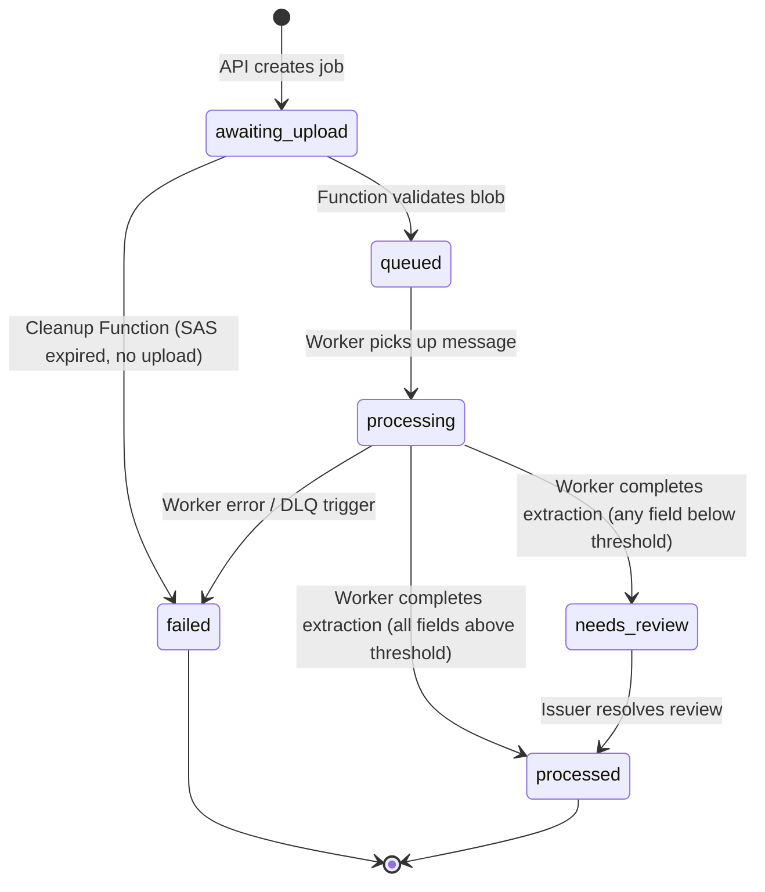

# Interface Contracts

> **Status:** All interface contracts below have been reviewed, aligned with [docs/DECISIONS.md](DECISIONS.md), and are marked **APPROVED / ACTIVE**.
> These contracts define the canonical boundaries between services.

---

## 1. Service Bus Message Schema

**Status: APPROVED / ACTIVE**

**Queue name:** `job-processing`

**Message body:**
```json
{
  "job_id": "<uuid>"
}
```

Only the `job_id` is sent. The worker looks up all other details (`blob_key`, `uploader_id`, etc.) from PostgreSQL. This keeps the message small and avoids stale data if the job row is updated between enqueue and dequeue.

**Dead-letter behavior (Decision D-008):**
- Service Bus moves a message to the dead-letter queue (DLQ) after the configured max delivery count (5 attempts).
- An Azure Monitor alert fires on any message landing in the DLQ.
- If the worker encounters an unrecoverable failure during execution, it marks `jobs.status = 'failed'` directly.
- If a poison message exhausts delivery attempts without worker recovery, an Azure Function DLQ trigger catches the message and marks `jobs.status = 'failed'` in PostgreSQL.

---

## 2. Blob Container Names & Path Format

**Status: APPROVED / ACTIVE**

| Container | Purpose | Watched by Event Grid? |
|---|---|---|
| `raw-uploads` | Incoming certificate scans | **Yes** — blob-created event filtered to this container only |

**Blob path format:**
```
raw-uploads/{job_id}/{original_filename}
```

The `job_id` is embedded in the path so the Azure Function can extract it from the blob URL without a database lookup. The user-delegation SAS token (Decision D-005) is scoped to this exact path with write-only permission.

---

## 3. Job Status State Machine

**Status: APPROVED / ACTIVE**



| Transition | Component | Notes |
|---|---|---|
| `→ awaiting_upload` | Go API | Job row created, SAS token issued |
| `awaiting_upload → queued` | Azure Function | Blob validated (type + size), message enqueued |
| `awaiting_upload → failed` | Cleanup Function | SAS expired without completed upload |
| `queued → processing` | Python Worker | Message dequeued, processing begins |
| `processing → processed` | Python Worker | All fields above confidence threshold |
| `processing → needs_review` | Python Worker | Any field below confidence threshold |
| `processing → failed` | Python Worker / DLQ | Unrecoverable error or max retries exceeded |
| `needs_review → processed` | Go API (issuer action) | Issuer confirms or corrects fields |

---

## 4. REST Endpoints — Go API

**Status: APPROVED / ACTIVE**

### Public (no auth)

| Method | Path | Description |
|---|---|---|
| `GET` | `/healthz` | Health check |
| `GET` | `/api/v1/verify/:publicVerificationId` | Public verification page data |

### Student (requires `Student` role)

| Method | Path | Description |
|---|---|---|
| `POST` | `/api/v1/jobs` | Request an upload (creates job, returns SAS token) |
| `GET` | `/api/v1/jobs` | List own jobs (filtered by `uploader_id`) |
| `GET` | `/api/v1/jobs/:id` | Get own job detail |

### Issuer (requires `Issuer` role)

| Method | Path | Description |
|---|---|---|
| `POST` | `/api/v1/jobs` | Request an upload (same endpoint, role determines `verified_by_issuer` auto-set) |
| `GET` | `/api/v1/jobs` | List all jobs |
| `GET` | `/api/v1/jobs/:id` | Get any job detail |
| `POST` | `/api/v1/jobs/bulk` | Bulk upload (create multiple jobs) |
| `GET` | `/api/v1/review` | List jobs needing review |
| `POST` | `/api/v1/review/:jobId` | Resolve a `needs_review` flag or confirm a student upload |
| `DELETE` | `/api/v1/jobs/:id` | Delete a job (admin action on student's explicit request) |

### Internal (worker → API, not externally exposed)

| Method | Path | Description |
|---|---|---|
| `POST` | `/internal/v1/jobs/:id/status` | Worker updates job status + triggers SignalR push |

### Auth

| Endpoint group | Auth requirement |
|---|---|
| Public | None |
| Student | Entra JWT with `Student` role in `roles` claim |
| Issuer | Entra JWT with `Issuer` role in `roles` claim |
| Internal | Shared secret or managed identity (not user-facing) |

### SignalR negotiate

| Method | Path | Description |
|---|---|---|
| `POST` | `/api/v1/signalr/negotiate` | Returns SignalR connection info for the authenticated user |

---

## 5. Normalization Rule for `fields_hash`

**Status: APPROVED / ACTIVE**

The `fields_hash` is a SHA-256 digest of the **canonical JSON** representation of extracted fields, computed as follows:

1. Build a JSON object with the extracted fields: `name`, `roll_number`, `register_number`, `degree`, `marks_json`, `cgpa`, `issue_date`.
2. **Sort keys** alphabetically at all levels.
3. **Trim** all string values (remove leading/trailing whitespace).
4. **Case-fold** all string values to lowercase.
5. **Fixed number format:** represent all numbers without trailing zeros (e.g., `3.5` not `3.50`).
6. **Fixed date format:** `YYYY-MM-DD` (ISO 8601).
7. **Marks JSON:** each entry sorted by subject key, values as trimmed/case-folded strings.
8. Serialize with no extra whitespace (compact JSON).
9. Compute SHA-256 of the resulting UTF-8 byte string.

This ensures the same extracted data always produces the same hash, regardless of formatting differences.

---

## 6. SignalR

**Status: APPROVED / ACTIVE**

- **Service mode:** Serverless (Azure SignalR Service, not self-hosted).
- **One group per user ID:** each authenticated user joins a group named after their `user_id`.
- **Who pushes:** the Go API pushes to SignalR via the SignalR Service REST API after receiving a status update from the worker's internal endpoint call.
- **Negotiate endpoint:** `POST /api/v1/signalr/negotiate` — returns the SignalR connection URL and access token for the authenticated user.
- **Message format:**
```json
{
  "target": "jobStatusUpdate",
  "arguments": [{
    "job_id": "<uuid>",
    "status": "<new_status>",
    "updated_at": "<ISO 8601 timestamp>"
  }]
}
```

---

## 7. Confidence Threshold

**Status: APPROVED / ACTIVE**

- **Starting value:** `0.85` (85%)
- **Configuration:** environment variable `CONFIDENCE_THRESHOLD`, not hardcoded.
- **Behavior:** if any field's confidence score falls below this threshold, the job is flagged as `needs_review`.
- **Tuning:** this value is an empirical parameter tuned during testing against the trained custom model.

---

## 8. Public Verification Page

**Status: APPROVED / ACTIVE**

### Public Fields (shown on the verification page)

| Field | Shown? |
|---|---|
| `name` | ✅ Yes |
| `roll_number` | ✅ Yes |
| `degree` | ✅ Yes (stored directly in `records.degree`) |
| `issue_date` | ✅ Yes |
| `source_hash` | ✅ Yes |
| `fields_hash` | ✅ Yes |
| `verified_by_issuer` | ✅ Yes |
| `marks_json` (full marks) | ❌ **No** — only summary (e.g., CGPA) is shown |
| `register_number` | ❌ No — not public |
| `confidence_json` | ❌ No — internal |

### Rate Limiting

- Rate limit on the public verification endpoint to prevent scraping: 30 requests per minute per IP.
