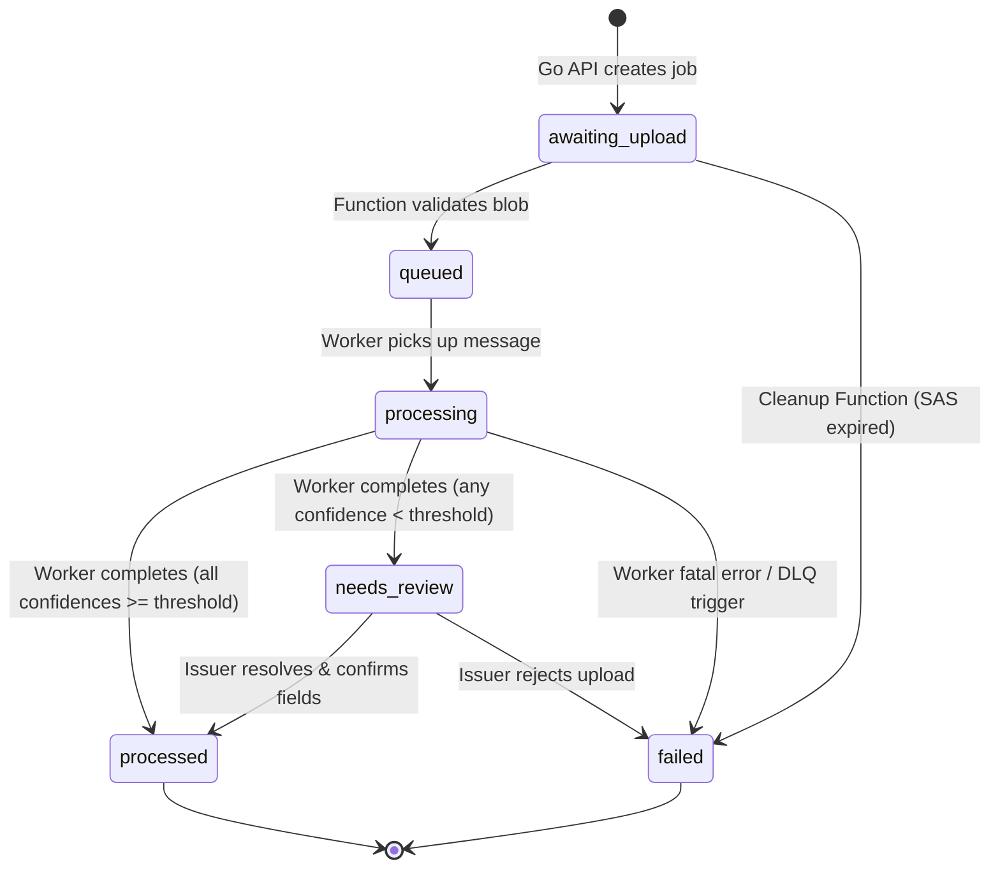

# Interface Contracts

> **Status:** All interface contracts below are **APPROVED / ACTIVE**.
> These contracts define the canonical boundaries, schemas, and interaction protocols between all services.

---

## 1. Service Bus Message Schema & Failure Protocol

**Status: APPROVED / ACTIVE**

**Queue name:** `job-processing`

**Message body:**
```json
{
  "job_id": "<uuid>"
}
```

Only `job_id` is sent. The worker looks up all job metadata (`blob_key`, `uploader_id`, etc.) directly from PostgreSQL. This keeps queue payloads tiny and prevents stale state if the job row is updated between enqueue and dequeue.

### Failure & Completion Protocol (Decision D-008)

1. **Successful Processing / Review Required:**
   - Worker writes the record to PostgreSQL, updates `jobs.status` (`processed` or `needs_review`), and immediately calls `receiver.complete_message(msg)` to remove the message from Service Bus.
2. **Unrecoverable Application Error (Fatal Failure):**
   - E.g., corrupted non-PDF/non-image blob, invalid schema, or permanent parsing error.
   - Worker directly updates PostgreSQL: `UPDATE jobs SET status = 'failed', updated_at = clock_timestamp() WHERE id = $1;`.
   - Worker immediately calls `receiver.complete_message(msg)` to remove the message. This prevents futile retries and protects worker throughput.
3. **Transient Infrastructure Failure (Retries):**
   - E.g., database connection blip, Azure Document Intelligence 429/503 throttle, or network timeout.
   - Worker calls `receiver.abandon_message(msg)` (or allows lock duration to expire). Service Bus increments the message delivery count.
4. **Dead-Letter Handling (Exhausted Retries):**
   - After reaching max delivery count (5 attempts), Service Bus automatically routes the poison message to the Dead-Letter Queue (DLQ).
   - An Azure Monitor alert fires on any message entering the DLQ (`ActiveMessages > 0` on DLQ entity).
   - A dedicated DLQ-trigger Azure Function reads the dead-lettered message, ensures `jobs.status` is set to `'failed'` in PostgreSQL, logs diagnostic error telemetry, and marks the job for administrator audit.

### Local Queue Peek-Lock Semantics (Phase 1 addition — PROPOSED)

In local development and Phase 1 testing, Service Bus is simulated via PostgreSQL table `local_queue_messages` with peek-lock semantics matching Azure Service Bus:
- **`receive(lock_duration_seconds=60)`**: Claims 1 message using `FOR UPDATE SKIP LOCKED`, ordered FIFO by `(enqueued_at, id)`. Only rows where `dead_lettered_at IS NULL`, `available_at <= now()`, and `(locked_until IS NULL OR locked_until < now())` are eligible.
  - If the claimed message already has `delivery_count >= MAX_DELIVERY (5)`, it is immediately dead-lettered with `dead_letter_reason = 'MaxDeliveryCountExceeded'`, and `receive` continues to the next eligible message.
  - Otherwise, increments `delivery_count`, sets `locked_until = now() + lock_duration`, and generates a fresh `lock_token UUID`.
- **`complete(message)`**: Deletes the row from `local_queue_messages`. Requires matching `lock_token` and `locked_until >= now()`, else raises `LockLostError`.
- **`abandon(message)`**: Clears the lock (`locked_until = NULL`, `lock_token = NULL`, `available_at = now()`) making the message available immediately for redelivery. Requires matching `lock_token` and `locked_until >= now()`, else raises `LockLostError`.
- **`dead_letter(message, reason)`**: Sets `dead_lettered_at = now()` and `dead_letter_reason`, clearing locks. Requires matching `lock_token` and `locked_until >= now()`, else raises `LockLostError`.
- **Lock expiration**: If a consumer crashes without completing or abandoning, the lock expires when `now() > locked_until`. The message automatically becomes visible again for subsequent `receive()` calls.

---

## 2. Blob Container Names & Path Format

**Status: APPROVED / ACTIVE**

| Container | Purpose | Watched by Event Grid? | Access Mechanism |
|---|---|---|---|
| `raw-uploads` | Incoming certificate scans directly uploaded by clients | **Yes** — blob-created event filtered strictly to this container | Scoped write-only user-delegation SAS token (15-min TTL) |
| `stamped-documents` | Generated QR-stamped PDF certificate copies | **No** — prevents infinite Event Grid trigger recursion | Short-lived read SAS or internal worker write |

### Blob Path Formats

- **Raw uploads:**
  ```
  raw-uploads/{job_id}/{sanitized_filename}
  ```
  *(Phase 1 contract change: uses `{sanitized_filename}` instead of `{original_filename}` to neutralize path traversal and disallowed characters).*
  The `job_id` is embedded in the blob path so the Azure Function extracts it directly from the Event Grid subject URL without performing a preliminary database query.

- **QR-Stamped certificates:**
  ```
  stamped-documents/{job_id}/stamped_certificate.pdf
  ```
  The stamped PDF is stored by job ID, linked to `records.public_verification_id`, and made downloadable upon public verification or issuer dashboard view.

---

## 3. Job Status State Machine & Writing Authority

**Status: APPROVED / ACTIVE**



### Writing Authority

- **Status Database Writes:** The **Python Worker** writes `records` rows and updates `jobs.status` (`processing`, `processed`, `needs_review`, `failed`) directly in PostgreSQL in an ACID transaction.
- **Real-Time Notification:** After writing to PostgreSQL, the worker calls the Go API internal endpoint (`POST /internal/v1/jobs/:id/notify`). The **Go API** then broadcasts the status event to the uploader's Azure SignalR group via the SignalR Service REST API.
- **Issuer Actions:** The **Go API** updates `jobs.status` and `records` when an issuer resolves a review (`needs_review → processed`) or rejects a submission (`needs_review → failed`).
- **Cleanup Actions:** The **Azure Function App** updates `jobs.status = 'failed'` for abandoned uploads after SAS expiry or for exhausted DLQ messages.

### Database-Enforced Transition Guard (Phase 1 addition)

A `BEFORE UPDATE OF status` trigger (`trg_jobs_status_guard`) enforces exactly the allowed transitions listed in the state diagram above, **minus** `needs_review → failed` (issuer rejection semantics deferred to Phase 4). Same-status updates are treated as no-ops and pass through. Any disallowed transition raises a `check_violation` error naming both statuses.

Additionally, a `BEFORE INSERT` trigger (`trg_jobs_insert_guard`) ensures all new `jobs` rows start with status `awaiting_upload`. Test fixtures must reach other statuses through valid transitions.

**Phase 1 note:** The Function stand-in also writes `failed` for invalid files (bad magic bytes, oversize) — a new writer path not in the original contract's Writing Authority list. This is recorded as a known deviation.

### Function Idempotency Rule (Phase 1 addition — PROPOSED)

Retrying a blob-created event on an already `queued` job re-sends the queue message and completes without error. The worker deduplicates redelivered or concurrent duplicate messages atomically via transactional locking (`SELECT FOR UPDATE`), treating redeliveries after completion as safe no-ops.

---

## 4. User Provisioning (JIT via Entra ID)

**Status: APPROVED / ACTIVE**

Because `jobs.uploader_id` enforces a foreign key constraint referencing `users(id)`, a user row must exist before an upload can be initiated:

1. When a client makes an authenticated request with a valid Entra ID Bearer JWT, the Go API authentication middleware extracts:
   - `entra_id`: extracted from token claim `oid` (object ID) or `sub`.
   - `name`: extracted from token claim `name`.
   - `role`: derived from Entra app roles claim `roles` (`issuer` or `student`).
2. The middleware executes an upsert:
   ```sql
   INSERT INTO users (entra_id, role, name)
   VALUES ($1, $2, $3)
   ON CONFLICT (entra_id) DO UPDATE
   SET name = EXCLUDED.name, role = EXCLUDED.role
   RETURNING id;
   ```
3. The resulting `users.id` UUID is injected into the request context as the caller's `user_id` and used as `uploader_id` for all job creation queries.

### Dev Authentication Contract (Phase 1 addition — PROPOSED)

When running in local dev mode (`AUTH_MODE=dev` AND `APP_ENV=local`), Entra ID JWTs are replaced with HTTP headers:
- `X-Dev-User`: Simulated Entra ID (object ID or subject). Required.
- `X-Dev-Role`: Simulated user role (`issuer` or `student`). Required.
- `X-Dev-Name`: Simulated display name. Required.

Any missing or empty header, or any role other than `issuer` or `student`, returns `401 Unauthorized`.
The JIT user provisioning executes identically using these claims.

---

## 5. REST Endpoints — Go API

**Status: APPROVED / ACTIVE**

### Public Endpoints (no auth)

| Method | Path | Description |
|---|---|---|
| `GET` | `/healthz` | Liveness and health probe |
| `GET` | `/api/v1/verify/:publicVerificationId` | Public verification record query (rate limited) |

### Student Endpoints (requires `Student` app role)

| Method | Path | Description |
|---|---|---|
| `POST` | `/api/v1/jobs` | Initiate upload; returns `job_id` and write-only SAS token for `raw-uploads` |
| `GET` | `/api/v1/jobs` | List student's own jobs (filtered strictly by `uploader_id`) |
| `GET` | `/api/v1/jobs/:id` | Get status and details for student's own job |
| `GET` | `/api/v1/jobs/:id/record` | Get completed record details, hashes, and public verification link |
| `GET` | `/api/v1/jobs/:id/read-url` | Generate temporary 15-minute read SAS URL to view uploaded document |

### Issuer Endpoints (requires `Issuer` app role)

| Method | Path | Description |
|---|---|---|
| `POST` | `/api/v1/jobs` | Initiate single upload (`verified_by_issuer` auto-sets to `true`) |
| `POST` | `/api/v1/jobs/bulk` | Bulk upload initialization (returns batch of job IDs and SAS tokens) |
| `GET` | `/api/v1/jobs` | List all jobs across institution with status filtering |
| `GET` | `/api/v1/jobs/:id` | Get details for any job |
| `GET` | `/api/v1/review` | List all jobs with status `needs_review` |
| `GET` | `/api/v1/review/:jobId` | Fetch job metadata, extracted record fields, and temporary `read_sas_url` for side-by-side preview |
| `POST` | `/api/v1/review/:jobId/resolve` | Resolve review; accepts confirmed/corrected fields, records audit in `corrections_json`, updates status to `processed` |
| `POST` | `/api/v1/review/:jobId/reject` | Reject submission; accepts `{ "rejection_reason": "string" }`, updates status to `failed`, notifies student via SignalR |
| `DELETE` | `/api/v1/jobs/:id` | Administrative deletion upon student GDPR/data request |

### Internal Endpoints (Worker → API, internal virtual network only)

| Method | Path | Description |
|---|---|---|
| `POST` | `/internal/v1/jobs/:id/notify` | Worker notifies API of status change (`processed`, `needs_review`, `failed`) to trigger SignalR broadcast |

### Dev Endpoints (Phase 1 addition — active only when AUTH_MODE=dev)

| Method | Path | Description |
|---|---|---|
| `PUT` | `/dev/upload/:jobId/:file` | Direct upload simulation endpoint (no auth headers required, mimics SAS URL). Enforces size cap and requires job in `awaiting_upload`. |

### POST /api/v1/jobs Response Contract (Phase 1 update — PROPOSED)

Status: `201 Created`
```json
{
  "job_id": "<uuid>",
  "blob_key": "raw-uploads/<uuid>/<sanitized_filename>",
  "upload": {
    "method": "PUT",
    "url": "http://127.0.0.1:8080/dev/upload/<uuid>/<sanitized_filename>",
    "expires_at": "2026-10-04T03:00:00Z"
  }
}
```

### Authentication & Authorization Rules

| Group | Authentication | Details |
|---|---|---|
| **Public** | None | Rate limited to 30 requests/minute per client IP |
| **Student** | Entra ID Bearer JWT | Verified against Azure Entra tenant; must contain `Student` in `roles` claim |
| **Issuer** | Entra ID Bearer JWT | Verified against Azure Entra tenant; must contain `Issuer` in `roles` claim |
| **Internal** | Shared Secret Header | Requires `X-Internal-Secret: <INTERNAL_API_KEY>` (managed in Key Vault); restricted to Container Apps internal virtual network ingress |

### SignalR Negotiation

| Method | Path | Description |
|---|---|---|
| `POST` | `/api/v1/signalr/negotiate` | Generates connection URL and user-scoped access token for Azure SignalR Service |

---

## 6. Normalization Rule for `fields_hash`

**Status: APPROVED / ACTIVE**

The `fields_hash` is an immutable SHA-256 digest of the **canonical JSON** representation of extracted certificate data. To guarantee deterministic hash identity between Python and Go:

1. **Extract Fields:** Construct an object containing: `name`, `roll_number`, `register_number`, `degree`, `marks_json`, `cgpa`, `issue_date`.
2. **Unicode Normalization:** Apply Unicode Normalization Form C (`NFC`) to all string values.
3. **Whitespace Normalization:** Collapse all sequences of whitespace (`\s+`) into a single space `' '`, and trim leading/trailing whitespace.
4. **Case-Folding:** Case-fold all string values to lowercase.
5. **String Decimal Representation:** Convert numeric values (e.g. `cgpa`) to canonical formatted strings without trailing zeroes (e.g. `"3.5"`, `"9.85"`). Integer marks are represented as decimal strings (e.g. `"92"`). This eliminates floating-point serialization discrepancies between Go (`float64`) and Python (`float`).
6. **Strict Date Format:** Standardize dates to `YYYY-MM-DD` (ISO 8601 string).
7. **Canonical Tabular Marks:** `marks_json` array of objects sorted alphabetically by subject code; values normalized with strings.
8. **Key Sorting:** Sort all dictionary/object keys alphabetically at all nesting levels.
9. **Compact Serialization:** Serialize without formatting whitespace (`separators=(',', ':')` in Python, compact encoding in Go).
10. **Digest:** Compute SHA-256 over the UTF-8 byte stream.

### Extractor Contract & Storage vs Normalization Rule (Phase 1 addition — PROPOSED)

- **Extractor Contract:** The document extraction engine must return `issue_date` formatted as an ISO date string (`YYYY-MM-DD`) and `cgpa` as a numeric decimal string (e.g. `"8.85"`), matching PostgreSQL `DATE` and `NUMERIC` column constraints. Text fields (`name`, `roll_number`, `register_number`, `degree`) and tabular marks cells may contain arbitrary casing and irregular spacing as captured from the source document.
- **Raw Storage in `records`:** The `records` database table stores text fields (`name`, `roll_number`, `register_number`, `degree`, and `marks_json`) exactly as returned by the extractor, preserving original casing, whitespace, and extraction order for marks rows.
- **Normalized Copy for Hashing:** Normalization (whitespace collapsing, case-folding, and marks table sorting by `subject_code`) applies strictly to an in-memory copy constructed exclusively for computing `fields_hash`. Recomputing `fields_hash` from the raw stored record fields by feeding them through the normalization algorithm yields the identical `fields_hash`.

---

## 7. Confidence Threshold & Tabular Marks Rule

**Status: APPROVED / ACTIVE**

- **Threshold Value:** Initial threshold `0.85` (85%), configured via environment variable `CONFIDENCE_THRESHOLD`.
- **Scalar Field Evaluation:** Each scalar field (`name`, `roll_number`, `register_number`, `degree`, `cgpa`, `issue_date`) has an OCR confidence score $\in [0.0, 1.0]$. If any scalar score $< \text{CONFIDENCE\_THRESHOLD}$, status becomes `needs_review`.
- **Tabular Marks Evaluation:** In `marks_json`, each extracted subject row consists of discrete cells (`subject_code`, `subject_name`, `marks_obtained`, `max_marks`, `grade`). Document Intelligence assigns a confidence score to each individual cell. If **any single cell** in the tabular marks falls below $\text{CONFIDENCE\_THRESHOLD}$, the entire job is flagged as `needs_review`.
- **Review Reason Audit:** The worker stores a breakdown of all sub-threshold fields in `records.confidence_json` to highlight uncertain fields on the issuer review screen.

---

## 8. Public Verification Page

**Status: APPROVED / ACTIVE**

### Public Fields

| Field | Exposed? | Notes |
|---|---|---|
| `name` | ✅ Yes | Student legal name |
| `roll_number` | ✅ Yes | Student institution roll number |
| `degree` | ✅ Yes | Degree title (e.g., "B.Tech Computer Science") |
| `cgpa` | ✅ Yes | Overall cumulative grade point average |
| `issue_date` | ✅ Yes | Date of certificate issuance |
| `source_hash` | ✅ Yes | SHA-256 of original scan |
| `fields_hash` | ✅ Yes | Canonical SHA-256 of extracted fields |
| `verified_by_issuer` | ✅ Yes | Issuer verification confirmation badge |
| `marks_json` (full subject marks) | ❌ **No** | Privacy protection — detailed transcript marks are not public |
| `register_number` | ❌ **No** | University private registration identifier |
| `confidence_json` | ❌ **No** | Pipeline internal OCR metrics |

### Rate Limiting

- 30 requests per minute per IP address on `/api/v1/verify/:publicVerificationId`.
