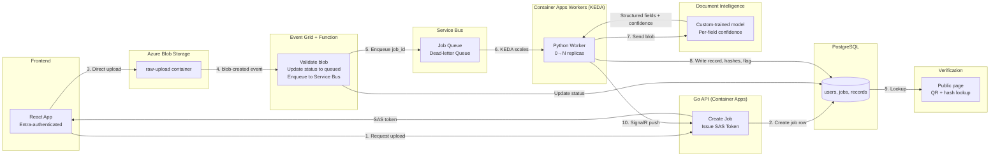
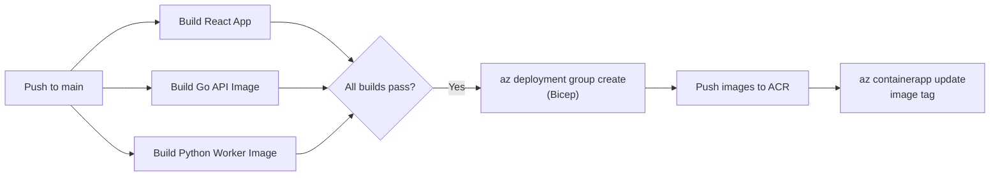

# Certificate Digitization & Verification Pipeline — Azure Architecture Report

> **Source PDF:** `Certificate Digitization & Verification Pipeline — Azure Architecture Report (1).pdf`
> **Date:** Oct 3, 2026
> **Author:** @Adiseshan Ramanan

Course: Cloud Computing · Institution: Amrita University, Coimbatore
Team: Adiseshan Ramanan (CB.SC.U4CSE23402) — add any teammates here before submission

---

## Problem Statement & Objectives

Academic institutions rely on DigiLocker and the National Academic Depository (NAD) for digitally-signed certificate issuance and verification going forward, but this leaves a backlog problem unsolved: records issued before an institution onboarded to NAD, plus scanned archives and physical copies, still need slow, manual verification — someone re-reads a document by eye. That process cannot absorb the demand spikes of results, placement, and admission season.

This project builds an institution-level pipeline that digitizes existing paper and scanned-image records into structured, confidence-scored data; flags low-confidence extractions for human review instead of trusting OCR silently; attaches a SHA-256 hash so a digitized record can be confirmed unaltered later via a QR-linked verification page; and scales processing capacity with actual incoming volume. It complements NAD-style issuance infrastructure rather than replacing it, targeting the records NAD does not already cover.

### Objectives

- Digitize existing certificates and marksheets into structured, searchable records
- Flag OCR extractions below a confidence threshold for manual review
- Provide a tamper-evident verification mechanism (hash + QR) for every digitized record
- Scale processing automatically with queue depth, down to zero cost when idle
- Stay deployable and testable within an Azure for Students budget

---

## Requirements

| Type | Requirement |
|---|---|
| Functional | Issuer can bulk-upload certificates and marksheets |
| Functional | Student can upload their own documents and check processing status |
| Functional | System extracts structured fields with a per-field confidence score |
| Functional | Low-confidence extractions route to an issuer review screen |
| Functional | Every processed record is independently verifiable via hash and QR code |
| Non-functional | A 500-upload burst in one day must not drop or stall processing |
| Non-functional | Workers scale to zero cost when idle |
| Non-functional | Total Azure spend stays within the $100 Azure for Students credit |
| Non-functional | No secret (connection string, API key) is stored in source code |

### Scope

**In scope:** issuer bulk upload, an issuer review screen for resolving `needs_review` flags and confirming student-submitted documents (with a `reviewed_by` / `reviewed_at` audit trail), student self-upload and status check, OCR extraction, confidence-based review flag, hash-based verification page, live status dashboard.

**Stretch goal:** external verifier lookup portal, read-only against the same database.

---

## System Architecture & Design

The pipeline uses Azure-native services chosen for one property each: direct-to-storage upload, event-driven triggering, buffered queuing, metric-driven autoscaling, confidence-scored extraction, and push-based status updates.

### Pipeline Diagram



The queue absorbs the burst so workers can scale from zero without dropping uploads, and every processed record carries a SHA-256 hash checkable via its QR code.

This diagram covers the document-processing core; cross-cutting concerns — the Go API, authentication, secrets, container registry, and monitoring — are covered in the table below and in the Security, Deployment, and Monitoring sections.

### Technology Selection

| Layer | Azure Service | Why this service | Alternative considered |
|---|---|---|---|
| Frontend | React | Upload portal and status dashboard | — |
| Backend API | Go API, Container Apps | Issues SAS tokens, creates job rows, exposes status and verification endpoints | Azure Functions for the API too — rejected, a long-lived API fits Container Apps better |
| Direct upload | Blob Storage, SAS token | Bypasses the backend for large files | — |
| Trigger | Event Grid + Azure Function | Validates every blob server-side so a client can't skip validation | API enqueues directly after upload — rejected, loses server-side validation on the stored file |
| Queue | Service Bus | Buffers bursts, decouples upload rate from processing rate | — |
| Workers | Container Apps + KEDA | Scales 0→N on Service Bus queue depth | Functions Premium with a Service Bus trigger — keeps at least one always-ready instance running, so it can't scale to zero cost the way Container Apps + KEDA can |
| OCR / extraction | AI Document Intelligence, custom model | Structured fields with a per-field confidence score | Self-hosted Tesseract — gives text only, no trained field-level extraction |
| Database | PostgreSQL Flexible Server | Structured, relational job and record storage | Cosmos DB — rejected, the data is relational, with foreign keys and transactional status updates |
| Auth | Microsoft Entra ID, app roles | Role-based access for issuer and student | Entra External ID for the verifier flow — dropped, the public verification page needs no login |
| Secrets | Azure Key Vault | Connection strings and API keys, referenced, not hardcoded | — |
| Container images | Azure Container Registry | Holds worker and API images | Must exist before the first CI/CD push |
| Monitoring | Application Insights + Azure Monitor | Request tracing, KEDA scaling events, dead-letter alerts | — |
| IaC / CI-CD | Bicep + GitHub Actions | Reproducible deploys, minimal manual portal steps | — |
| Live update | Azure SignalR Service | Removes WebSocket connection-state management once the API runs multiple replicas | Polling or server-sent events — simpler at this scale; SignalR buys headroom, not raw necessity |

### Scalability

KEDA polls Service Bus queue depth directly, not CPU, and scales Container Apps workers from 0 to a configured maximum. At zero pending jobs, zero workers run; a burst drains by adding replicas, then scales back down after a cooldown.

The Go API runs the same way: minimum replicas set to 0 on Container Apps, budgeted like the workers. It's warmed up with a dummy request a few minutes before any live demo, so the first real interaction isn't the one paying the cold-start cost.

### Reliability

Each job carries a status: `awaiting_upload`, `queued`, `processing`, `processed`, `needs_review`, or `failed`. The API creates a job as `awaiting_upload` before the file exists; the Function flips it to `queued` once the blob lands and passes validation. A scheduled cleanup Function clears `awaiting_upload` jobs whose SAS token has expired without a completed upload, so an abandoned upload doesn't linger forever. A worker that crashes mid-job leaves its message unacknowledged, so Service Bus redelivers it; a message that fails repeatedly moves to a dead-letter queue for manual inspection instead of retrying forever.

### Design Trade-offs

**Why SignalR Service, not polling?** At a few dashboard users, plain polling or server-sent events would also work. SignalR removes WebSocket connection-state management once the API runs multiple replicas — architectural headroom, not raw necessity at demo scale.

**Why Event Grid + Function instead of the API enqueuing directly?** The API could enqueue a job right after confirming the upload. Routing through a blob-triggered Function instead means every file is validated server-side against what actually landed in storage, so a client can't skip validation.

**Why Azure, not AWS?** Both clouds have equivalents for every piece here. Azure was chosen because Container Apps has KEDA built in, Document Intelligence's custom models return per-field confidence for the review workflow, and the Azure for Students credit covers building and testing the whole system at no cost.

**Why cloud at all for 500 documents?** A single VM and a queue could handle that volume. The case for this architecture rests on the spikiness of demand — a 5/day baseline against a 500-upload burst — and the cost of idle capacity, not on raw volume.

---

## Implementation & Functionality

Ten steps take a document from upload to a verifiable record.

1. **Request.** Issuer or student logs in via React (Entra-authenticated) and calls the Go API to start an upload.

2. **Create job.** The API creates an `awaiting_upload` job row in PostgreSQL first — recording the uploader and whether they are the issuer — then issues a SAS token scoped to a blob path that embeds the job ID.

3. **Landing.** The frontend uploads the file straight to Blob Storage using that token, bypassing the backend.

4. **Trigger.** The blob-created event, filtered to the raw-upload container only, fires Event Grid, which invokes a Function. The Function validates file type and size, flips the job's status from `awaiting_upload` to `queued`, and sends a message to Service Bus referencing the job ID.

5. **Queue.** Service Bus holds the job — the buffer that lets uploads spike without workers falling over.

6. **Scale.** KEDA sees queue depth rise and scales Container Apps workers from 0 toward the configured maximum.

7. **Extraction.** A worker pulls the job, downloads the blob, and sends it to a custom-trained Document Intelligence model, which returns structured fields (name, roll number, register number, subject-wise marks, CGPA, date of issue) each with a confidence score.

8. **Write, hash, and flag.** The worker writes the extracted fields to PostgreSQL; computes a SHA-256 hash of the original source file and a second hash of the normalized extracted fields; and sets status to `processed`, or `needs_review` if any field's confidence falls below threshold. `verified_by_issuer` is set `true` automatically for issuer uploads, and stays `false` for student uploads until an issuer confirms them on the review screen.

9. **Verify.** A QR-stamped copy is generated for printing; the QR encodes the record's random `public_verification_id`, not a sequential ID. The public verification page looks up that ID and shows both hashes, the key extracted fields, and the `verified_by_issuer` status, so even a fresh re-scan of a genuine certificate can be confirmed field-for-field.

10. **Live update.** The worker calls an internal API endpoint after each write; the API pushes the status to the uploader's own SignalR group via the Service's REST API (there's no official Go SDK), so the dashboard updates without polling.

> `needs_review` and `verified_by_issuer` answer different questions: one flags OCR uncertainty, the other flags whether the issuer has vouched for the document's authenticity. A student upload can be high-confidence OCR and still unverified until an issuer confirms it.

---

## Security & Access Control

Two roles — issuer and student — carry different permissions, enforced through Microsoft Entra ID; the verifier needs no identity at all.

| Role | Identity provider | Can do |
|---|---|---|
| Issuer (exam cell) | Entra ID, institutional account | Bulk upload, view all jobs, resolve `needs_review` flags, confirm student uploads |
| Student | Entra ID, institutional account | Upload own documents, view own job status only |
| Verifier (external) | None required for a single hash/QR check; Entra External ID only if the stretch-goal verifier portal is built | Read-only lookup on the public verification page |

### Additional Controls

- **SAS tokens** are scoped to a single blob path, write-only, and expire shortly after issue, so a leaked link cannot be reused or browsed.
- **Data in transit** is TLS-encrypted end to end: frontend to API, API to Blob/Service Bus/PostgreSQL.
- **Data at rest** uses Blob Storage and PostgreSQL's default encryption-at-rest.
- **Secrets** (connection strings, API keys) live in Azure Key Vault, referenced by Container Apps and Functions, never hardcoded or committed.
- **Database access** uses a managed identity for the API and workers instead of a stored password where the service supports it.
- **Access scoping:** a student's queries are filtered to their own `uploader_id` in the Go API's query layer — application-level authorization, not PostgreSQL row-level security (RLS). A stretch goal is enforcing this with real Postgres RLS policies instead of relying on the API layer alone.
- **Role assignment:** Entra app roles (Issuer, Student) are assigned to each institutional account and checked from the JWT's `roles` claim in the Go API's auth middleware on every request.

---

## Database & Data Management

PostgreSQL Flexible Server holds three core tables.

| Table | Key columns | Purpose |
|---|---|---|
| `users` | id, entra_id, role, name | Issuer and student identities, role-tagged — the verifier has no stored identity |
| `jobs` | id, uploader_id, blob_key, status, created_at, updated_at | One row per uploaded document, tracks pipeline status; `blob_key` is unique |
| `records` | id, job_id, name, roll_number, register_number, marks_json, cgpa, issue_date, confidence_json, source_hash, fields_hash, public_verification_id, verified_by_issuer, reviewed_by, reviewed_at, corrections_json | Extracted fields, per-field confidence, both integrity hashes, issuer verification status, reviewer audit trail, and prior field values from any correction; `job_id` is unique |

### ER Diagram

```mermaid
erDiagram
    users ||--o{ jobs : "uploads"
    jobs ||--o| records : "produces at most one"
    users {
        uuid id PK
        string entra_id UK
        string role
        string name
    }
    jobs {
        uuid id PK
        uuid uploader_id FK
        string blob_key UK
        string status
        timestamp created_at
        timestamp updated_at
    }
    records {
        uuid id PK
        uuid job_id FK_UK
        string name
        string roll_number
        string register_number
        jsonb marks_json
        numeric cgpa
        date issue_date
        jsonb confidence_json
        string source_hash
        string fields_hash
        uuid public_verification_id UK
        boolean verified_by_issuer
        uuid reviewed_by FK
        timestamp reviewed_at
        jsonb corrections_json
    }
```

### CRUD Operations

- **Create:** the API inserts a `jobs` row when it issues the SAS token; a worker inserts a `records` row after extraction.
- **Read:** the dashboard reads a user's own `jobs`; the verification page reads one `records` row by `public_verification_id`.
- **Update:** a worker updates `jobs.status`; an issuer resolving a `needs_review` flag, or confirming a student upload, updates `records.verified_by_issuer`, `reviewed_by`, and `reviewed_at`. If the issuer corrects a field, the worker recomputes `fields_hash` from the corrected values and writes the prior values to `records.corrections_json`, so nothing is silently overwritten.
- **Delete:** scoped to an issuer admin action on a student's explicit request, not exposed elsewhere.

`jobs.blob_key` and `records.job_id` carry unique constraints, and the worker upserts on conflict — so a message Service Bus redelivers after a crash can't create a duplicate row. A job produces at most one record, not exactly one, since a job that ultimately fails produces none.

`jobs.status`, `records.public_verification_id`, and `records.source_hash` are indexed, since status drives dashboard loads and the verification ID and hash drive every public lookup.

---

## Deployment & DevOps

All infrastructure is defined as code with Bicep, so the environment is torn down and rebuilt identically between sessions rather than clicked together by hand.

- **Source control:** GitHub, one repo with `/frontend`, `/api`, `/worker`, `/infra` folders.
- **CI/CD:** GitHub Actions builds the React app, the Go API, and the Python worker image on every push to `main`; on success it runs `az deployment group create` against the Bicep templates and pushes the worker image to Azure Container Registry. The registry is provisioned by Bicep before this workflow's first run, since the image push target must already exist.
- **Configuration management:** environment-specific values (connection strings, queue names, model endpoint) are injected as Container Apps environment variables sourced from Key Vault references, not baked into images.
- **Reproducibility:** a fresh Azure for Students subscription is brought to a working deployment by running the Bicep template, then one `az containerapp update` for the worker image tag. Two manual prerequisites sit outside Bicep: labeling sample certificates and training the custom Document Intelligence model in Document Intelligence Studio, and registering the Entra app used for authentication — both one-time setup steps, documented rather than automated.
- **Environments:** a single dev/demo environment is sufficient for this project's scope; the Bicep parameters file is the only thing that would change for a second environment.

### CI/CD Diagram



> **Note:** The PDF caption says four stages but the diagram effectively shows five steps (build, Bicep deploy, push to ACR, update container apps, and the overall pass/fail gate). See [DECISIONS.md](DECISIONS.md) for this discrepancy.

---

## Monitoring, Performance & Optimization

Azure Monitor and Application Insights track the pipeline end to end: Function execution time, Service Bus's Active Messages metric (`ActiveMessages`), Container Apps replica count, and per-job processing latency from `queued` to `processed`.

### Burst Load Test

The Document Intelligence free tier (F0) caps extraction at the first two pages of a document and a 4 MB file size limit, and allows 500 pages/month — training the custom model itself stays free regardless of tier. That quota can't absorb a real 500-document burst test, so the worker supports a `--stub-extractor` flag that skips the Document Intelligence call and returns a fixed confidence value during load testing; real extraction is exercised separately on a small sample within the free quota.

**Measurable target:** p95 time from upload to `processed`, measured with the stub extractor, under 5 minutes for a 500-upload burst from a cold, zero-replica start. This is a target to verify, not a claim already measured — a load-test script records actual p50/p95 latency and the time for KEDA to scale from 0 to peak replicas before submission.

**KEDA scale rule:** 1 replica per 5 pending Service Bus messages, minimum 0, maximum 20 replicas, 30-second polling interval, 5-minute cooldown after the queue drains. An Azure Monitor alert fires on any message that lands in the dead-letter queue.

### Known Trade-off

Scale-to-zero means the first job after an idle period pays a cold-start cost: container image pull and startup, on the order of seconds, before processing begins. Later jobs in the same burst do not pay this cost again. This is reported honestly rather than folded into the latency numbers.

### Optimization Notes

- Confidence-threshold tuning on the Document Intelligence model balances false `needs_review` flags against missed errors; this is a parameter to sweep during testing, not a fixed guess.
- Worker concurrency (jobs pulled per replica) is tuned against Document Intelligence's own rate limits, not just Service Bus throughput.

---

## Innovation & Problem Solving

Four design choices go beyond a straightforward upload-and-store pipeline.

1. **Custom-trained extraction, not generic OCR.** The Document Intelligence model is trained on labeled sample certificates rather than used as a plain text reader, so it returns structured key-value pairs (roll number, CGPA, subject table) with a per-field confidence score, not just a block of text.

2. **Confidence drives a workflow, not just a log.** The `needs_review` flag turns OCR uncertainty into a routed task for the issuer, rather than a number nobody acts on.

3. **Tamper-evident verification that survives a re-scan, without a blockchain.** A hash of the source file plus a hash of the normalized extracted fields, together with an issuer-confirmation flag, let a verifier check a record two ways: byte-for-byte against the original scan, or field-for-field against a fresh re-scan of the same paper certificate.

4. **Scale-to-zero as a cost argument, not just a performance one.** KEDA's queue-depth scaling means the system runs zero workers on a baseline day and scales out only during actual bursts, which is stated as a budget constraint this project had to design around, not a theoretical benefit.

The main technical challenge was choosing an autoscaling signal that reflects real backlog (queue depth) instead of a proxy that doesn't (CPU), since OCR workers spend most of their time waiting on I/O, not computing.

---

## Limitations

Both hashes live in the same database as the data they describe, so anyone with database access could alter the record and its hashes together — the hashes prove the stored fields haven't silently drifted since processing, not that the database itself is tamper-proof. The verifier page is designed to be checked against the physical document by eye, not treated as a cryptographic guarantee. A stretch goal is signing each hash with an Azure Key Vault key, so a database-level change would break a signature nobody inside the system can forge.

---

## Documentation & Demo Plan

### Screenshots to Capture

- AI Studio: sample certificates labeled for the custom Document Intelligence model, and the trained model's test run showing per-field confidence
- The issuer dashboard: bulk upload in progress, and the review screen resolving a `needs_review` flag
- Container Apps replica count scaling from 0 to N during a burst, captured from the Azure portal or Monitor
- The Service Bus queue-depth graph during the same burst
- The public verification page, showing a QR-code lookup result

### Demo Script

1. Show the issuer dashboard at rest — zero workers running, empty queue.
2. Trigger a burst (the load-test script) and narrate the KEDA scale-out live against the replica-count graph.
3. Open one `needs_review` record and resolve it from the issuer review screen.
4. Scan the QR code on a sample digitized certificate and show the verification page matching the hash and fields.
5. Show the dashboard updating live via SignalR, no page refresh.
6. Close on the cost picture: zero-replica baseline versus the burst, tying back to the budget section.

### Pre-build Checks

→ See [SETUP_CHECKS.md](SETUP_CHECKS.md)

### Build Order

→ See [BUILD_PLAN.md](BUILD_PLAN.md)

---

## Assumptions, Workload Model & Budget

### Workload Model

The 5-uploads/day baseline versus 500-upload burst during results week is an assumed design workload — chosen to illustrate a low baseline with sharp seasonal spikes, not based on measured data from a real institution.

### Budget: Azure for Students, $100 credit, 12 months

→ See [COST.md](COST.md) for the full budget table, cost guardrails, and the Postgres 7-day auto-restart reminder.

Budget estimate for a full build–test–demo–viva cycle: $20–40 of the $100 credit, driven mainly by active Postgres hours plus the Container Registry's flat fee.
